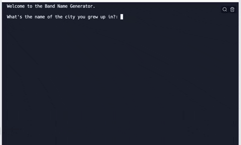

# Day 1 - Working with Variables in Python to Manage Data


## Day 1 - Final Exercise


https://replit.com/@yassine05/day1finalexercise


## Day 1 - Notes
```python
print("Welcome to the Band Name Generator.\n")

street = input("What's the name of the city you grew up in?: ")
pet = input("What's your pet's name?: ")

print("Your band name could be " + street + " " + pet)
```


