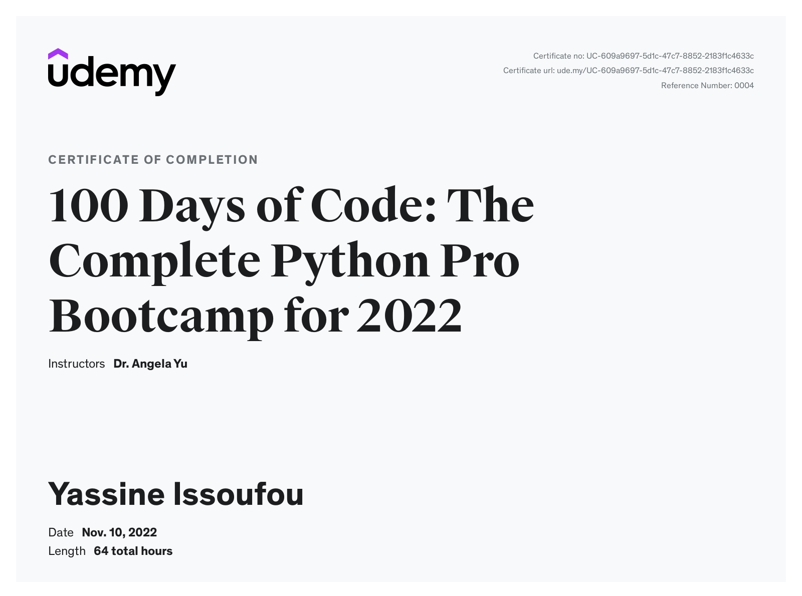

<h1 align="center" <a href="https://www.udemy.com/course/100-days-of-code/">100 Days of Code: The Complete Python Pro Bootcamp for 2022</a> </h1>

    I recently completed this Python bootcamp, this course was really helpful in taking me from an absolute beginner to a professional level. Throughout this comprehensive course i completed 100s of small project and dozens of real world prjects, I will also be completing a couple professional job resume/porfolio projects, lookout for them on my github. This repo will be use to post all my notes, to access later and share with others learning python.

---
## Tools and technologies used/learned
- Python 3
- Vscode, PyCharm, Jupyter Notebook
- Python Scripting and Automation
- Python Game Development
- Web Scraping
- Beautiful Soup
- Selenium Web Driver
- Request
- WTForms
- Data Analytics
- Pandas
- NumPy
- Matplotlib
- Plotly
- Scikit learn
- Seaborn
- Turtle
- Python GUI Desktop App Development
- Tkinter
- Front-End Web Development
- HTML 5
- CSS 3
- Bootstrap 4
- Bash Command Line
- Git, GitHub and Version Control
- Backend Web Development
- Flask
- REST
- APIs
- Databases
- SQL
- SQLite
- PostgreSQL
- Authentication
- Web Design
- Deployment with GitHub Pages, Heroku and GUnicorn

---
## About the course
> - 64h 2m total length
> - 101 sections 
> - 676 lectures 
> - 64h 2m total length
> - 100+ projects

---
## Certification

This certificate above verifies that Yassine Issoufou successfully completed the course <a href="https://www.udemy.com/course/100-days-of-code/">100 Days of Code: The Complete Python Pro Bootcamp for 2022 </a> on 11/10/2022 as taught by Dr. Angela Yu on Udemy. The certificate indicates the entire course was completed as validated by the student. The course duration represents the total video hours of the course at time of most recent completion.

---
@github.com/fulanii